# Job Alert Agent: Canonical System Design Diagrams & Architectural Blueprints

This document serves as the master architectural reference and design blueprint repository for the **Job Alert Agent**. It contains high-fidelity Mermaid diagrams and structured technical breakdowns for all system modules and agentic subsystems.

---

## Table of Contents
1. [End-to-End System Topology](#1-end-to-end-system-topology)
2. [Task-Complexity-Based Dynamic Model Routing (Task 8.4)](#2-task-complexity-based-dynamic-model-routing-task-84)
3. [Unified LLM Priority Queue & Dynamic Concurrency Scaling](#3-unified-llm-priority-queue--dynamic-concurrency-scaling)
4. [Conversational AI Career Copilot & Action Dispatcher (Task 8.1)](#4-conversational-ai-career-copilot--action-dispatcher-task-81)
5. [Google for Jobs & Google Alerts Ingestion Engine (Task 8.3)](#5-google-for-jobs--google-alerts-ingestion-engine-task-83)
6. [External ATS Portal Learning & Decoded Direct Scraping](#6-external-ats-portal-learning--decoded-direct-scraping)
7. [LinkedIn Saved Jobs Full-Fidelity & Auto-Pruning State Machine](#7-linkedin-saved-jobs-full-fidelity--auto-pruning-state-machine)
8. [Dense Vector Embeddings & Semantic Indexing Subsystem](#8-dense-vector-embeddings--semantic-indexing-subsystem)
9. [Single Unified Hybrid Chrome Extension Architecture (Task 8.6)](#9-single-unified-hybrid-chrome-extension-architecture-task-86)
10. [The 5 Pillars of the Agentic Execution Harness](#10-the-5-pillars-of-the-agentic-execution-harness)
11. [Strict Structured Outputs & Schema Enforcement (Task 8.2)](#11-strict-structured-outputs--schema-enforcement-task-82)
12. [Semantic Prompt & Response Caching Engine (Task 8.5)](#12-semantic-prompt--response-caching-engine-task-85)
13. [Resume-Driven Company Discovery & STAR Project Coach (Phase 9 Blueprint)](#13-resume-driven-company-discovery--star-project-coach-phase-9-blueprint)
14. [Zero-Trust Application Security & Encryption Architecture](#14-zero-trust-application-security--encryption-architecture)
15. [Opportunity Radar (Structured Hiring-Intent Ranking)](#15-opportunity-radar-structured-hiring-intent-ranking)
16. [C4 Architectural Model Suite (Levels 1 to 4)](#16-c4-architectural-model-suite-levels-1-to-4)
17. [Major System Data Flow Diagrams (DFD Level 1 & 2)](#17-major-system-data-flow-diagrams-dfd-level-1--2)
    * [17.1 DFD 1: Discovery & Zero-Token Semantic Due Diligence Flow](#171-dfd-1-multi-channel-job-discovery-due-diligence--zero-token-semantic-ingestion-flow)
    * [17.2 DFD 2: Multi-Turn Copilot RAG & Action Dispatch Flow](#172-dfd-2-conversational-copilot-multi-turn-rag--dynamic-action-dispatch-flow)
    * [17.3 DFD 3: Single Unified Chrome Extension & DOM Telemetry Flow](#173-dfd-3-single-unified-hybrid-chrome-extension--dom-telemetry-flow)
    * [17.4 DFD 4: Autonomous Concurrency, Worker Pacing & Queue Flow](#174-dfd-4-autonomous-concurrency-worker-pacing--priority-queue-flow)
    * [17.5 DFD 5: Zero-Trust Security & Cryptographic Privacy Flow](#175-dfd-5-zero-trust-security-origin-firewall--cryptographic-privacy-flow)
    * [17.6 DFD 6: Multi-Platform Application Tracker & Lifecycle Sync](#176-dfd-6-multi-platform-application-tracker--lifecycle-synchronization-flow)
    * [17.7 DFD 7: Background Task Engine & Periodic Scheduler](#177-dfd-7-background-task-engine-progress-streaming--periodic-scheduler-flow)
    * [17.8 DFD 8: Tech Stack Compatibility Matrix & Hiring Team Dossier](#178-dfd-8-tech-stack-compatibility-matrix--embedded-hiring-team-dossier-flow)
18. [Full-Stack Dual-Sink Observability & Request Tracing Layer](#18-full-stack-dual-sink-observability--request-tracing-layer)
19. [Text-Mode Architecture, Deployment & Module Dependency Map](#19-text-mode-architecture-deployment--module-dependency-map)
20. [Structured Match Analysis, Interview Prep & No-Fabrication](#20-structured-match-analysis-interview-prep--no-fabrication)

---

## 1. End-to-End System Topology

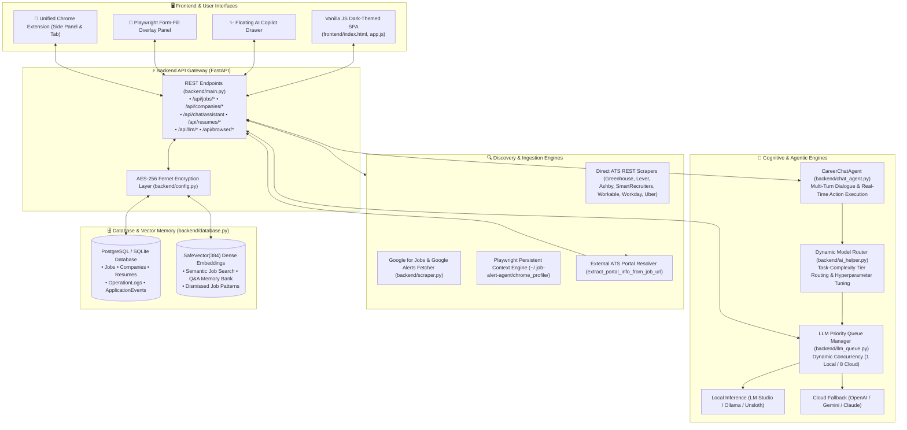

---

## 2. Task-Complexity-Based Dynamic Model Routing (Task 8.4)

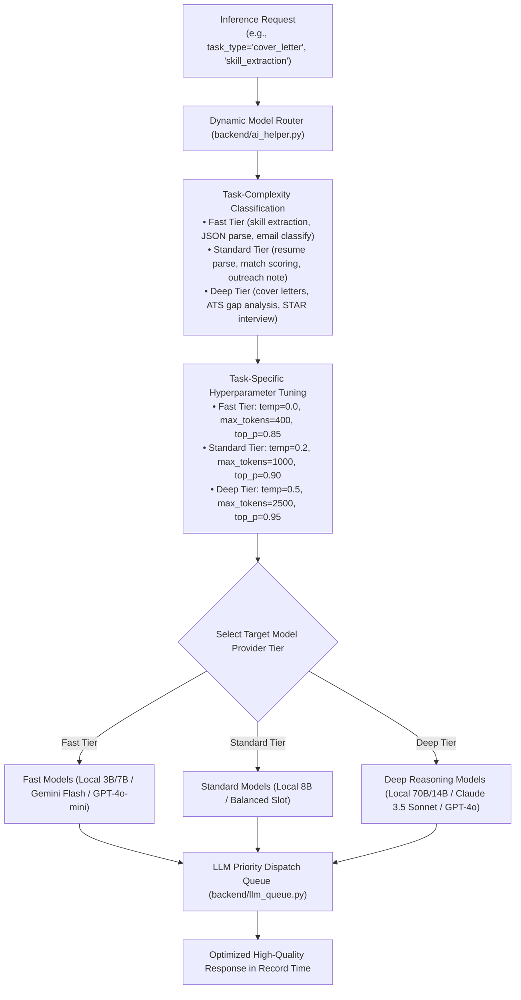

---

## 3. Unified LLM Priority Queue & Dynamic Concurrency Scaling

```mermaid
flowchart LR
    subgraph Inbound["Inbound Request Streams"]
        Req1["⚡ Interactive User Click\n(Apply / Tailor / Chat)"] -->|Priority: ON_DEMAND (1)| Q
        Req2["🔍 Background Feed Scrape\n(Batch of 20 Jobs)"] -->|Priority: BACKGROUND (3)| Q
    end

    subgraph Queue_Manager["Dynamic Queue Dispatcher (backend/llm_queue.py)"]
        Q["Priority Queue (Min-Heap Priority)"]
        Detector{"Active Provider Type"}
        Q --> Detector
        Detector -->|Local (LM Studio / Ollama)| LocalWorker["1 Worker (0.2s Pacing Interval)\nPrevents GPU VRAM Thrashing"]
        Detector -->|Cloud API (Gemini / OpenAI)| CloudWorkers["8 Parallel Async Workers (0.0s Pacing)\nHigh-Throughput Concurrent Processing"]
    end

    subgraph Execution["Inference Execution"]
        LocalWorker --> LocalExec["Local Metal / CUDA GPU"]
        CloudWorkers --> CloudExec["Cloud REST Endpoints"]
    end

    LocalExec & CloudExec --> Return["Return Formatted Result & Log Token Usage"]
```

---

## 4. Conversational AI Career Copilot & Action Dispatcher (Task 8.1)

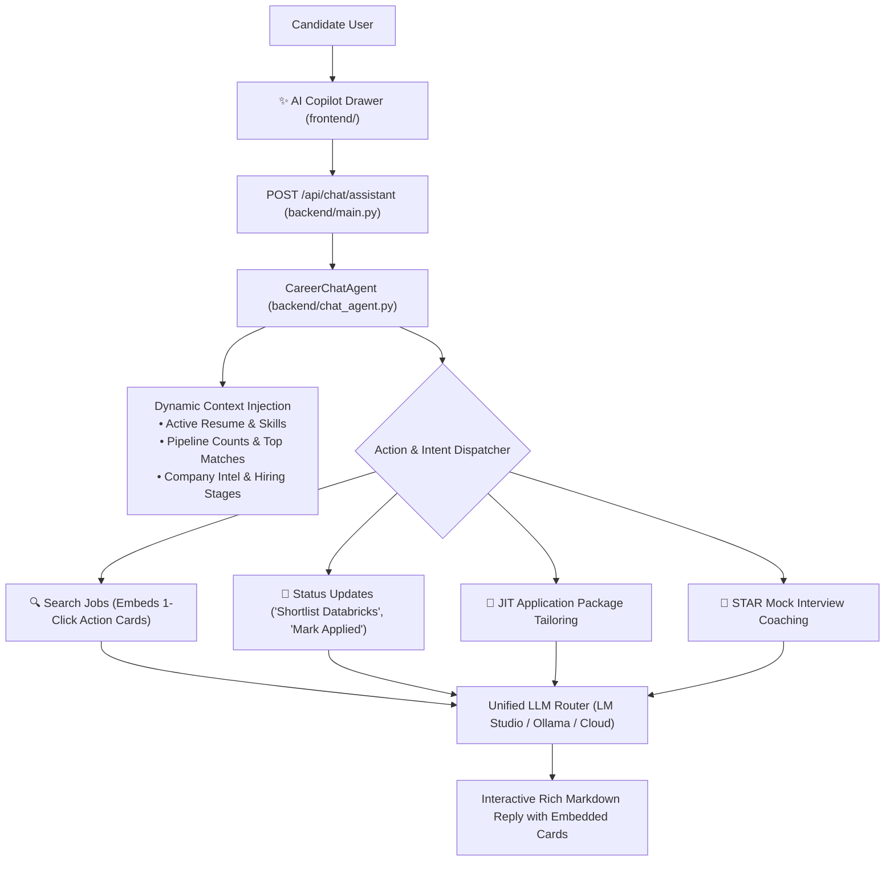

---

## 5. Google for Jobs Followed Alerts & Multi-Query Batch Engine (Task 8.3)

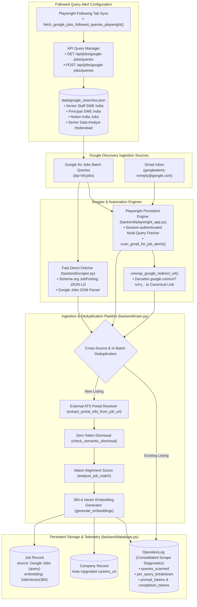

---

## 6. External ATS Portal Learning & Decoded Direct Scraping

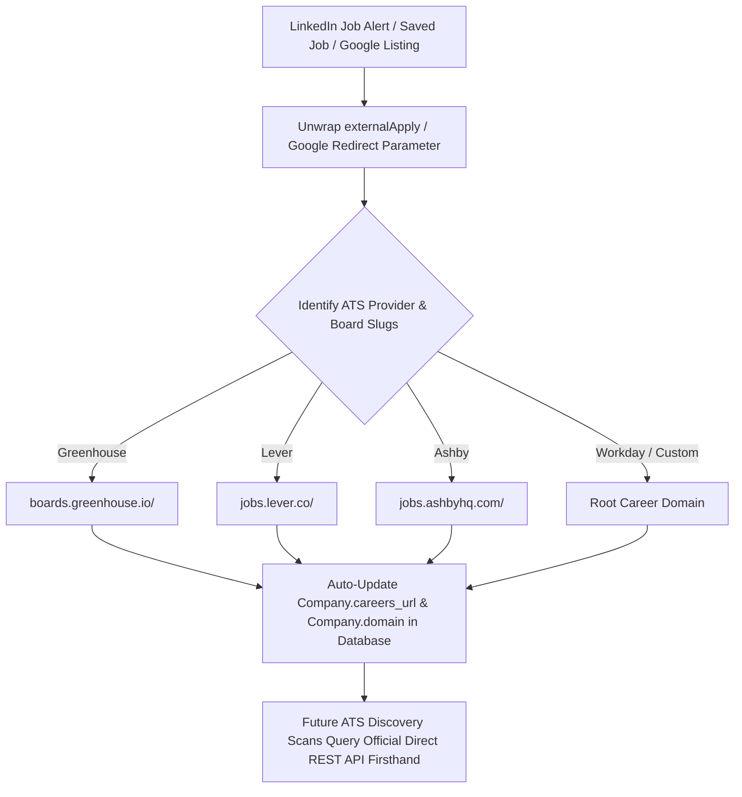

---

## 7. LinkedIn Saved Jobs Full-Fidelity & Auto-Pruning State Machine

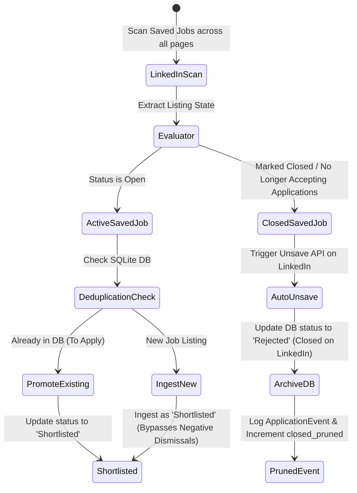

---

## 8. Dense Vector Embeddings & Semantic Indexing Subsystem

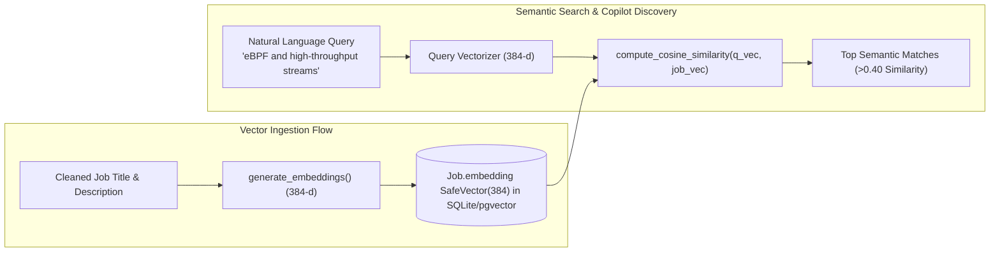

---

## 9. Single Unified Hybrid Chrome Extension Architecture (Task 8.6)

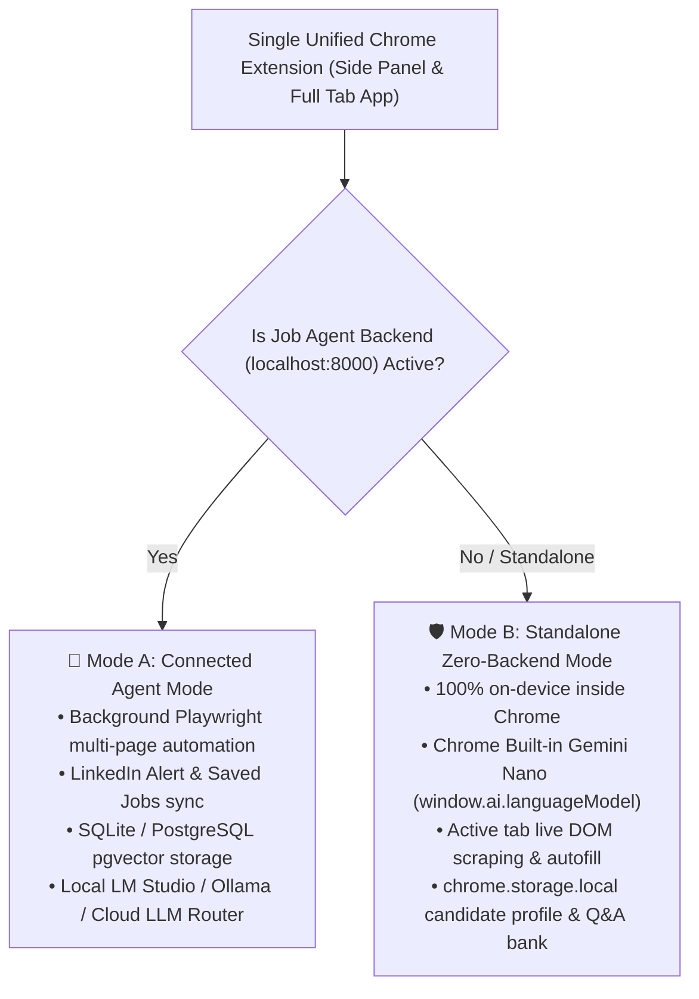

---

## 10. The 5 Pillars of the Agentic Execution Harness

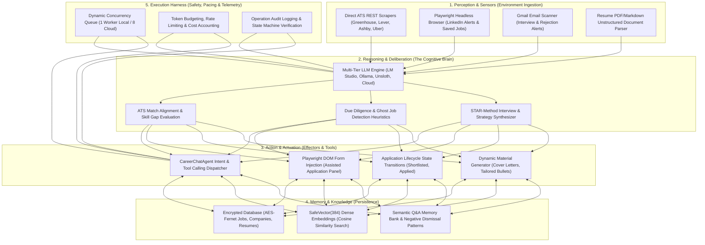

---

## 11. Strict Structured Outputs & Schema Enforcement (Task 8.2)

```mermaid
flowchart TD
    AppCall["Specialized AI Function\n(analyze_job_match / parse_resume)"] --> GenStruct["generate_structured(schema: Type[T], ...)\n(backend/ai_helper.py)"]
    GenStruct --> SchemaExtract["Extract JSON Schema via schema.model_json_schema()"]
    SchemaExtract --> ProviderCheck{"Target LLM Provider"}
    
    ProviderCheck -->|OpenAI| OAI["response_format = {type: 'json_schema', strict: True}"]
    ProviderCheck -->|Gemini| GEM["responseSchema = JSON Schema"]
    ProviderCheck -->|Ollama| OLL["format = JSON Schema (Grammar Constrained)"]
    ProviderCheck -->|Anthropic| ANT["Tool Schema Constraint (tool_choice = structured_output)"]
    ProviderCheck -->|LM Studio / Unsloth| LOC["System JSON Schema Injection + JSON Mode"]
    
    OAI & GEM & OLL & ANT & LOC --> LLMExec["LLM Inference Execution"]
    LLMExec --> Validator["Pydantic V2 schema.model_validate_json()"]
    Validator -->|Success (100% Type-Safe)| Result["Validated Pydantic V2 Object"]
    Validator -->|Unrepaired JSON String| RepairFallback["_clean_json_string() + Schema Repair"] --> Result
```

---

## 12. Semantic Prompt & Response Caching Engine (Task 8.5)

```mermaid
flowchart TD
    FormReq["Application Question\n(e.g., 'Why do you want to join our team?')"] --> VecGen["384-d Dense Embedding Generator\n(generate_embeddings(question))"]
    VecGen --> CacheLookup["Semantic Cache Search\n(search_qa_memory / resolve_semantic_essay_cache)"]
    CacheLookup --> CosineEval{"Cosine Similarity\nvs Memory Bank (≥ 0.85)"}
    
    CosineEval -->|⚡ Cache Hit (≥0.85)| HitFound["Recall High-Quality Cached Answer"]
    HitFound --> VarAdapt["Dynamic Variable & Context Adapter\n(Replace Company / Role tokens if needed)"]
    VarAdapt --> FastReturn["🚀 Instant Response (<5ms, 0 Tokens Spent)"]
    FastReturn --> IncrementCount["Increment use_count & updated_at in DB"]
    
    CosineEval -->|❌ Cache Miss (<0.85)| TaskTier["Task-Complexity Model Router\n(task_type='application_essay')"]
    TaskTier --> LLMGen["LLM Generates Tailored STAR Answer\n(Resume + Company Intelligence)"]
    LLMGen --> AutoIndexer["Auto-Learning Indexing Loop"]
    AutoIndexer --> SaveDB[("Insert into ApplicationQuestionAnswer\nwith 384-d Embedding & Category")]
    SaveDB --> FreshReturn["Return Generated Answer\n(Prompt Tokens Recorded)"]
```

---

## 13. Resume-Driven Company Discovery & STAR Project Coach (Phase 9 Blueprint)

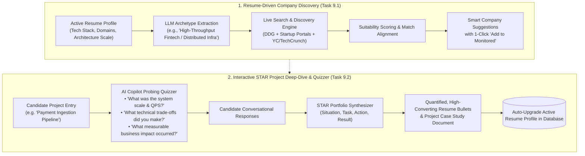

---

## 14. Zero-Trust Application Security & Encryption Architecture

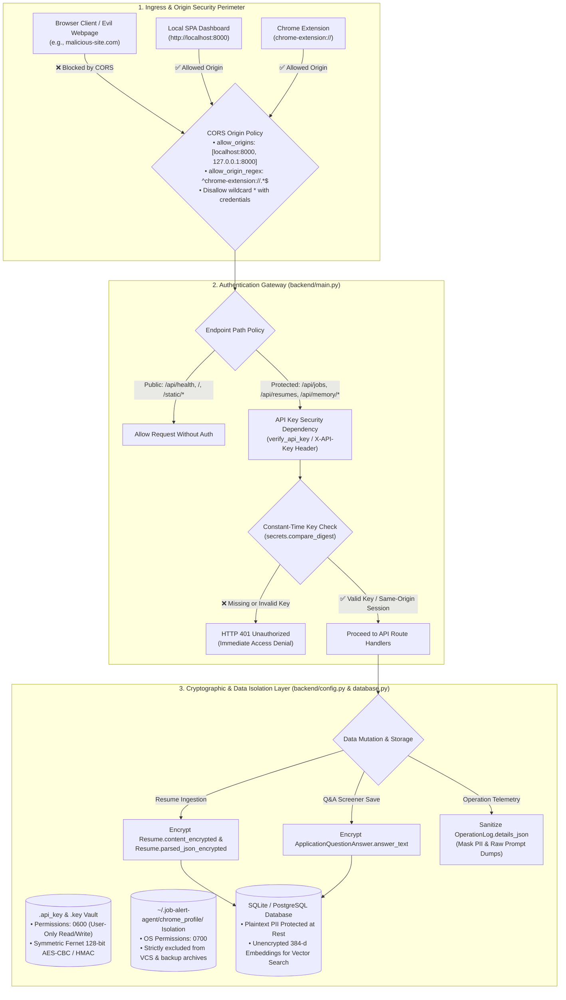

### Architectural Breakdown:
1. **Origin Hardening & Cross-Origin Mitigation**: Wildcard CORS origins are eliminated. The API server accepts requests strictly from verified localhost addresses and Chrome extension runtime origins, mitigating cross-site scripting/exfiltration from external websites.
2. **API Key Authentication (`X-API-Key`)**: All sensitive API operations require an `X-API-Key` header validated using constant-time string comparison (`secrets.compare_digest`) to prevent timing attacks.
3. **Column-Level Fernet Encryption at Rest**: `Resume.content_encrypted`, `Resume.parsed_json_encrypted`, and `ApplicationQuestionAnswer.answer_text` are encrypted using AES-128-CBC with HMAC-SHA256 authenticated symmetric encryption.
4. **Credential & Telemetry Sanitization**: Browser cookies in `~/.job-alert-agent/chrome_profile/` are quarantined with `0700` POSIX permissions, and operation log details are scrubbed to prevent accidental candidate data exposure in diagnostic payloads.

---

## 15. Opportunity Radar (Structured Hiring-Intent Ranking)

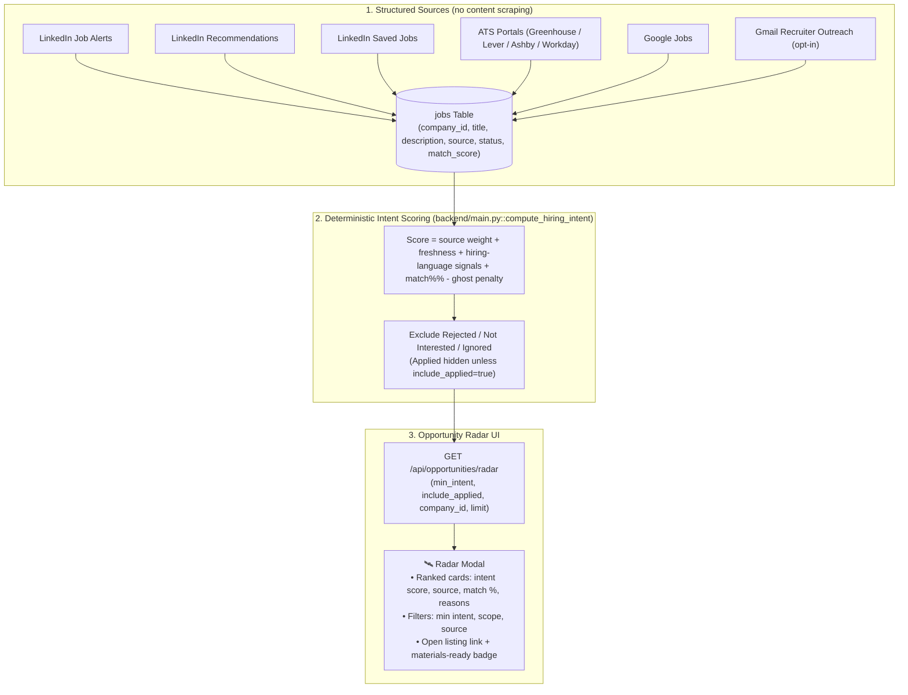

### Architectural Breakdown:
1. **Structured-Only Discovery**: The radar never scrapes LinkedIn content posts. It ranks opportunities already ingested from LinkedIn job alerts/recommendations/saved jobs, ATS portals, Google Jobs, and (opt-in) Gmail recruiter outreach.
2. **Deterministic Scoring (Zero Tokens)**: `compute_hiring_intent` combines source weight, recency, hiring-language signals, match score, and a ghost-job penalty — no LLM inference and no brittle DOM parsing.
3. **Actionable Scope**: Terminal statuses are excluded; applied roles are hidden unless explicitly requested.
4. **No Unofficial Endpoints**: The former `/api/linkedin/search-hiring-posts` content scraper, the `HiringPost` model/table, and the scheduled `hiring_posts_scan` job were removed in favor of this structured path.

---

## 16. C4 Architectural Model Suite (Levels 1 to 4)

### 16.1 Level 1: System Context Diagram (Context)
The System Context diagram illustrates how the **Job Alert Agent System** fits into the candidate's ecosystem and interfaces with external career platforms, ATS backends, and AI inference engines.

```mermaid
flowchart TB
    Candidate["👤 Candidate / Job Seeker\n(Tech Professional seeking software roles)"]

    subgraph SystemBoundary ["📦 Job Alert Agent System (Local & Autonomous)"]
        SystemCore["🤖 Job Alert Agent Platform\n• Autonomous Discovery & Ingestion\n• ATS Gap Scoring & Ghost Job Due Diligence\n• Intelligent In-DOM Application Autofill\n• AI Career Copilot & Manager Outreach"]
    end

    subgraph ExternalPlatforms ["🌐 External Career Platforms & Portals"]
        LinkedIn["💼 LinkedIn Web Platform\n(Saved Jobs, Recommended Feeds, Job Alerts)"]
        ATS["🏢 Company ATS Portals\n(Greenhouse, Lever, Ashby, SmartRecruiters, Workable, Workday, Uber)"]
        GoogleJobs["🔍 Google for Jobs & Gmail\n(Followed Search Digests & Alert Emails)"]
    end

    subgraph InferenceEngines ["🧠 AI & Reasoning Providers"]
        LocalLLM["🖥️ Local LLM Inference Engine\n(LM Studio :1234 / Ollama :11434 / Unsloth :8008)\n[Local-First Privacy]"]
        CloudLLM["☁️ Cloud AI Providers (Opt-In Fallback)\n(OpenAI / Gemini / Anthropic)"]
    end

    Candidate <-->|Manages applications, triggers scans, inspects matches, chats with Copilot| SystemCore
    SystemCore <-->|Scrapes alerts & saved jobs, unwraps links| LinkedIn
    SystemCore <-->|Scrapes career boards, inspects forms, autofills applications| ATS
    SystemCore <-->|Ingests followed query alerts & processes email digests| GoogleJobs
    SystemCore <-->|Executes local structured reasoning (1-worker VRAM pacing)| LocalLLM
    SystemCore <-->|Executes high-throughput batch analysis (8 parallel workers)| CloudLLM
```

---

### 16.2 Level 2: Container Diagram (Containers)
The Container diagram zooms into the Job Alert Agent system boundary, showcasing the high-level technical runtime blocks, frontend clients, backend services, persistent stores, and security vaults.

```mermaid
flowchart TB
    Candidate["👤 Candidate / User"]

    subgraph ClientLayer ["🖥️ Client & Browser UI Layer"]
        SPA["🌐 Frontend SPA (Vanilla JS + HTML5 + CSS3)\n• Dark-Mode Pipeline Kanban\n• Token & Cost Analytics\n• Opportunity Radar Modal\n• Interactive Career Copilot Drawer"]
        Extension["🧩 Chrome Extension (Manifest V3)\n• Content Scripts (In-DOM Inspector & Autofill)\n• Background Service Worker\n• Side Panel Assistant & Settings\n• Runtime Adapter (Connected vs Standalone)"]
    end

    subgraph BackendRuntime ["⚡ Backend Service Layer (FastAPI / Python)"]
        APIGateway["🚀 FastAPI API Gateway & Agent Runtime\n• REST Endpoints (/api/jobs, /api/companies, etc.)\n• Zero-Trust CORS & API Key Firewall Middleware\n• Dynamic Model Router & Task Classifier\n• Priority Concurrency Queue Dispatcher\n• Anti-Slop Content Generation Engine"]
        PlaywrightDaemon["🎭 Playwright Headless Browser Automation\n• Persistent Session State (~/.job-alert-agent/chrome_profile/)\n• Session-Authenticated LinkedIn & Google Scraper\n• HTTP Redirect Chain & ATS Link Unwrapper"]
    end

    subgraph StorageLayer ["🗄️ Storage & Cryptographic Vault Layer"]
        Database[("🗄️ Database & Vector Memory (backend/database.py)\n• PostgreSQL (pgvector) / SQLite\n• Resumes, Companies, Jobs, Events, Logs\n• 384-d Cosine Vector Embeddings\n• Encrypted Screener Q&A Memory Bank")]
        CryptoVault[("🔐 Key Vault (.api_key & .key)\n• Fernet Symmetric Cipher Key (0600)\n• System API Secret Token (0600)\n• Quarantined Browser Profile (0700)")]
    end

    subgraph ExternalServices ["🌐 External Cloud & Local AI Services"]
        LocalInference["🖥️ Local Inference Server\n(LM Studio / Ollama / Unsloth)"]
        CloudInference["☁️ Cloud AI APIs\n(OpenAI / Gemini / Anthropic)"]
        ExternalWeb["🌍 Target Websites & Portals\n(Greenhouse, Lever, Ashby, LinkedIn)"]
    end

    Candidate -->|Interacts with dashboard| SPA
    Candidate -->|Browses job postings| Extension
    SPA -->|REST HTTP + same-origin session| APIGateway
    Extension -->|REST HTTP + X-API-Key header| APIGateway
    Extension -->|Injects autofill scripts & inspects forms| ExternalWeb
    APIGateway <-->|Controls automated workflows| PlaywrightDaemon
    PlaywrightDaemon <-->|Navigates with saved cookies| ExternalWeb
    APIGateway <-->|Reads & writes ORM records & vectors| Database
    APIGateway <-->|Loads cipher & validates API tokens| CryptoVault
    APIGateway <-->|Paced local inference (0.2s cooling)| LocalInference
    APIGateway <-->|Concurrent cloud batching (8 workers)| CloudInference
```

---

### 16.3 Level 3: Component Diagram (Backend Gateway Container)
The Component diagram inspects the internals of the FastAPI Backend container (`backend/`), showing all modular services, dispatchers, and data pipelines.

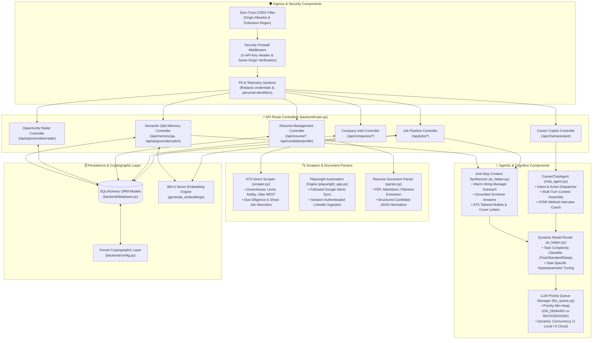

---

### 16.4 Level 4: Code & Data Entity Class Diagram
The Entity Class diagram documents the core domain models, foreign key relationships, encrypted properties, and vector associations in `backend/database.py`.

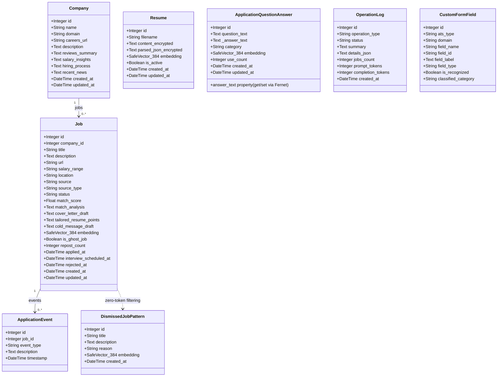

---

## 17. Major System Data Flow Diagrams (DFD Level 1 & 2)

### 17.1 DFD 1: Multi-Source Job Discovery, Due Diligence & Ingestion Flow
Maps the lifecycle of job listings ingested across direct ATS portals, Google for Jobs, and LinkedIn Saved Jobs into the active candidate pipeline.

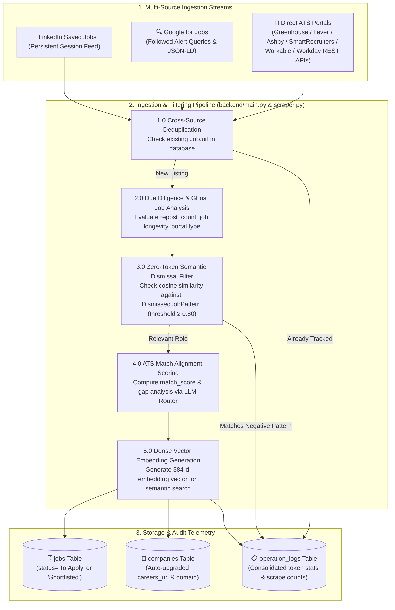

---

### 17.2 DFD 2: Opportunity Radar Ranking Flow
Traces how the radar ranks structured, already-ingested opportunities by deterministic hiring-intent signals and surfaces them in the SPA.

```mermaid
flowchart TD
    UserTrigger["👤 User Trigger\n(Toolbar '🛰️ Opportunity Radar' or Company Card '🛰️ Radar')"] --> APIReq["1.0 GET /api/opportunities/radar\n(min_intent, include_applied, company_id, limit)"]

    subgraph SourcePool ["2.0 Structured Source Pool (no content scraping)"]
        APIReq --> QueryJobs["2.1 Query jobs Table\n• LinkedIn alerts/recommendations/saved jobs\n• ATS portals, Google Jobs, Gmail recruiter outreach"]
        QueryJobs --> FilterStatus["2.2 Exclude Rejected / Not Interested / Ignored\n(Applied hidden unless include_applied=true)"]
    end

    subgraph ScoringProcess ["3.0 Deterministic Intent Scoring (compute_hiring_intent)"]
        FilterStatus --> ScoreSignals["3.1 Sum signals\n• Source weight (recruiter outreach > LinkedIn alerts > ATS > Google)\n• Freshness, hiring-language, match%\n• Ghost-job penalty"]
        ScoreSignals --> Rank["3.2 Sort by intent score, then match score"]
    end

    subgraph SurfaceUI ["4.0 Radar Surface"]
        Rank --> RenderModal["4.1 Render Ranked Cards\n• Intent score, source, match %, reasons\n• Open listing link, materials-ready badge"]
    end
```

---

### 17.3 DFD 3: Intelligent In-DOM Application & Screener Q&A Autofill Flow
Illustrates how the Chrome Extension inspects external ATS job application forms, resolves repeating Work History and Education blocks, leverages semantic memory for screener questions, and injects answers into the DOM.

```mermaid
flowchart TD
    subgraph DOMInspection ["1.0 In-DOM Form Telemetry & Filtering"]
        ATSPage["📄 Candidate on ATS Application Form\n(Greenhouse / Lever / Workday / Ashby)"] --> InjectScript["1.1 Extension Content Script Injected\n(ats-autofill.js)"]
        InjectScript --> CaptchaFilter["1.2 isIgnoredOrHiddenField(input)\nExclude reCAPTCHA, Turnstile, CSRF, honeypots"]
        CaptchaFilter --> LabelClean["1.3 getFieldCleanLabel(input)\nExtract clean human question text without element IDs"]
    end

    subgraph MappingStages ["2.0 Multi-Stage Intelligent Autofill Engine"]
        LabelClean --> Stage1["2.1 Stage 1: Work History & Experience\nMap container i to experience[i] (Company, Title, Dates, Bullets)"]
        Stage1 --> Stage2["2.2 Stage 2: Education\nMap container i to education[i] (School, Degree, Major, GPA)"]
        Stage2 --> Stage3["2.3 Stage 3: General Profile & Contact\nFirst Name, Last Name, Email, Phone, LinkedIn, Visa Status"]
        Stage3 --> Stage4["2.4 Stage 4: Custom Screener Essay Questions\nDetect non-standard technical & behavioral questions"]
    end

    subgraph QAResolution ["3.0 Semantic Q&A Memory Bank & Grounded Pitch"]
        Stage4 --> CacheCheck["3.1 Search Semantic Memory (resolve_semantic_essay_cache)\n384-d Cosine Similarity vs Memory Bank"]
        CacheCheck -->|⚡ Hit (≥0.85)| RecallAnswer["3.2 Recall Cached High-Quality Answer\nAdapt company & role variables (<5ms)"]
        CacheCheck -->|❌ Miss (<0.85)| GroundedGen["3.3 Synthesize Grounded Anti-Slop Pitch (generate_grounded_anti_slop_pitch)\nQuery cached Company intelligence + Candidate resume"]
        GroundedGen --> AutoLearn[("3.4 Auto-Learn & Index into application_question_answers")]
    end

    subgraph InjectionAudit ["4.0 In-DOM Injection & Telemetry"]
        RecallAnswer & GroundedGen --> AutofillDOM["4.1 Populate Inputs & Trigger Input/Change Events"]
        AutofillDOM --> TelemetrySync["4.2 Forward Unrecognized Form Fields to /api/forms/telemetry"]
        TelemetrySync --> CustomCatalog[("4.3 Update custom_form_fields Table")]
    end
```

---

### 17.4 DFD 4: Conversational Career Copilot & Dynamic Model Routing Flow
Traces how user chat messages are processed by the AI Career Copilot, classified by task complexity, queued with dynamic concurrency, and executed across local or cloud LLM backends.

```mermaid
flowchart TD
    UserPrompt["👤 User Message\n('How should I answer this salary question?', 'Show my top matches')"] --> CopilotUI["1.0 Floating AI Copilot Drawer (SPA)"]
    CopilotUI --> APIChat["2.0 POST /api/chat/assistant\n(backend/main.py)"]

    subgraph ContextAssembly ["3.0 Context & Intent Assembly (CareerChatAgent)"]
        APIChat --> LoadContext["3.1 Aggregate Dynamic System Context\n• Decrypted Resume Text & Skills\n• Active Pipeline Counts & Top Matches\n• Target Company Records & Hiring Stages"]
        LoadContext --> IntentClassifier{"3.2 Classify User Intent"}
        IntentClassifier -->|Search / Filter Jobs| ActSearch["Search Jobs Tool"]
        IntentClassifier -->|Pipeline State Update| ActStatus["Status Update Tool"]
        IntentClassifier -->|Material Generation| ActMaterial["Tailor Package Tool"]
        IntentClassifier -->|Interview Coaching| ActSTAR["STAR Coaching Loop"]
    end

    subgraph DynamicRoutingQueue ["4.0 Dynamic Model Router & Priority Queue"]
        ActSearch & ActStatus & ActMaterial & ActPosts & ActSTAR --> TaskClassifier["4.1 Classify Task Complexity Tier\n• Fast Tier: Skill extraction, JSON parsing\n• Standard Tier: Match scoring, outreach notes\n• Deep Tier: STAR coaching, cover letters"]
        TaskClassifier --> Hyperparams["4.2 Apply Tier Hyperparameters\n(temperature, max_tokens, top_p)"]
        Hyperparams --> PriorityQueue["4.3 Push to Priority Queue (llm_queue.py)\nPriority: ON_DEMAND (1)"]
        PriorityQueue --> ConcurrencyDispatch{"4.4 Active Provider Concurrency"}
        ConcurrencyDispatch -->|Local GPU (LM Studio / Ollama)| LocalWorker["1 Worker (0.2s Pacing Interval)\nPrevents GPU VRAM Thrashing"]
        ConcurrencyDispatch -->|Cloud API (OpenAI / Gemini)| CloudWorker["8 Parallel Async Workers\nHigh-Throughput Concurrent Calls"]
    end

    subgraph ResponseTelemetry ["5.0 Execution & Rich Markdown Response"]
        LocalWorker & CloudWorker --> ReturnResponse["5.1 Synthesize Markdown Reply with Embedded 1-Click Cards"]
        ReturnResponse --> RecordTokens[("5.2 Record Token & Cost Telemetry in token_tracker")]
        RecordTokens --> CopilotUI
    end
```

---

### 17.5 DFD 5: Zero-Trust Security, Origin Firewall & Cryptographic Privacy Flow
Illustrates the cryptographic boundary, origin verification, API key firewall, and column-level Fernet encryption pipelines protecting sensitive candidate data.

```mermaid
flowchart TD
    subgraph InboundRequest ["1.0 Inbound Client Request"]
        ClientReq["HTTP Request\n(Headers, Method, Path, Body)"] --> OriginEval{"1.1 Evaluate Origin & Referer"}
    end

    subgraph SecurityPerimeter ["2.0 Zero-Trust CORS & Authentication Firewall"]
        OriginEval -->|Cross-Origin Malicious Site| RejectCORS["2.1 Blocked by CORS Origin Firewall\n(No Access-Control-Allow-Origin)"]
        OriginEval -->|Localhost :8000 / Chrome Extension| KeyEval{"2.2 Evaluate Authentication"}
        
        KeyEval -->|Exempt Public Path: /api/health, /, /docs| AllowPublic["2.3 Allow Public Pass-Through"]
        KeyEval -->|X-API-Key Header / Bearer Token| CompareKey["2.4 Constant-Time Key Comparison\n(secrets.compare_digest)"]
        KeyEval -->|Same-Origin Local Session (Sec-Fetch-Site: same-origin)| AllowSameOrigin["2.5 Allow Same-Origin Session"]
        
        CompareKey -->|❌ Invalid Key| Reject401["2.6 HTTP 401 Unauthorized Response"]
        CompareKey -->|✅ Valid Key| AllowPass["2.7 Pass to Protected Route Handlers"]
    end

    subgraph CryptographicOperations ["3.0 Cryptographic Processing & Sanitization"]
        AllowPass & AllowSameOrigin --> RouteType{"3.1 Operation Type"}
        
        RouteType -->|Read Operation (e.g. GET /api/resume, /api/memory/qa)| DecryptAtRest["3.2 Column-Level Fernet Decryption\ndecrypt_data(content_encrypted) using .key"]
        DecryptAtRest --> ReturnPlaintext["3.3 Return Decrypted Payload to Authorized Client"]
        
        RouteType -->|Write Operation (e.g. POST /api/resume/upload, /api/memory/qa)| EncryptAtRest["3.4 Column-Level Fernet Encryption\nencrypt_data(raw_text) using .key"]
        EncryptAtRest --> PersistCiphertext[("3.5 Persist Ciphertext in Database Tables\nresumes, application_question_answers")]
        
        RouteType -->|Telemetry & Audit Logging| SanitizeLog["3.6 Sanitize OperationLog details_json\nMask API keys, passwords, and candidate email addresses"]
        SanitizeLog --> SaveLog[("3.7 Insert Sanitized Record into operation_logs")]
    end
```

---

### 17.6 DFD 6: Multi-Platform Application Tracker & Lifecycle Synchronization Flow
Illustrates the automated synchronization of submitted job applications across **Hirist.tech**, **Greenhouse.io**, **Lever**, and **Gmail Decision Alerts**, including state machine transitions, requisition-active probing, and audit event logging.

```mermaid
flowchart TD
    subgraph Trigger ["1.0 Ingestion & Sync Trigger"]
        ClientCall["POST /api/applications/sync-external\n(sources: ['hirist', 'greenhouse', 'lever', 'gmail'])"] --> AuthCheck{"1.1 Firewall Verification"}
        AuthCheck -->|✅ Valid API Key / Same-Origin| SyncDispatcher["1.2 Dispatch Synchronization Tasks"]
    end

    subgraph HiristTracker ["2.0 Hirist Candidate Dashboard Sync"]
        SyncDispatcher -->|source in ['hirist', 'all']| HiristPW["2.1 Playwright Persistent Session (~/.job-alert-agent/chrome_profile/)"]
        HiristPW --> NavHirist["2.2 Navigate to https://www.hirist.tech/candidate/applications"]
        NavHirist --> ScrapeCards["2.3 Scrape Cards across Pagination:\n• Title • Company • Recruiter Pipeline Badge • Applied Date • URL"]
        ScrapeCards --> NormalizeStatus["2.4 Normalize Status:\n• 'Interview Scheduled' -> 'Interview'\n• 'Not Shortlisted' -> 'Rejected'\n• 'Shortlisted' -> 'Shortlisted'\n• 'Applied' / 'Viewed' -> 'Applied'"]
        NormalizeStatus --> CorrelateHirist{"2.5 Correlate with Database"}
        
        CorrelateHirist -->|Existing Job in DB| CheckTransition{"Status Changed?"}
        CheckTransition -->|Yes| UpdateJobStatus["2.6 Transition Job.status & Set Timeline Dates\n(applied_at, interview_scheduled_at, rejected_at)"]
        UpdateJobStatus --> LogHiristEvent["2.7 Insert ApplicationEvent('external_status_sync')"]
        
        CorrelateHirist -->|New Application| IngestNewJob["2.8 Ingest Job(source='Hirist Applications', status=target_status)\nCompute Match Score & Embedding"]
        IngestNewJob --> LogIngestEvent["2.9 Insert ApplicationEvent('external_application_ingested')"]
    end

    subgraph GreenhouseAndEmailTracker ["3.0 Greenhouse, Lever & Gmail Decision Alerts Sync"]
        SyncDispatcher -->|source in ['greenhouse', 'gmail', 'all']| GmailScan["3.1 Scan Gmail for Recruiter Emails (scan_gmail_for_job_alerts)"]
        GmailScan --> ClassifyEmails["3.2 Classify Emails (parse_email_classification):\n• 'interview' -> Invitation / scheduling link\n• 'rejection' -> Decision notice\n• 'application_received' -> Confirmation"]
        ClassifyEmails --> ExtractHeaders["3.3 Extract Employer & Role from Subject/Snippet\n(extract_company_and_role_from_email_header)"]
        ExtractHeaders --> CorrelateEmail{"3.4 Correlate with Existing Job"}
        
        CorrelateEmail -->|Match Found & Rejection| RejectJob["3.5 Update Job.status='Rejected', rejected_at=now\nInsert ApplicationEvent('rejection_email')"]
        CorrelateEmail -->|Match Found & Interview| InterviewJob["3.6 Update Job.status='Interview', interview_scheduled_at=now\nInsert ApplicationEvent('interview_invite')"]
        
        SyncDispatcher -->|source in ['greenhouse', 'all']| ProbeGH["3.7 Probe Greenhouse Jobs for Active Requisitions\n(probe_greenhouse_job_active via API / HTTP)"]
        ProbeGH -->|Requisition 404/Closed| CloseGHJob["3.8 Update Job.status='Rejected'\nInsert ApplicationEvent('requisition_closed')"]

        SyncDispatcher -->|source in ['lever', 'all']| ProbeLV["3.9 Probe Lever Jobs for Active Requisitions\n(probe_lever_job_active via Public Postings API)"]
        ProbeLV -->|Requisition 404/Closed| CloseLVJob["3.10 Update Job.status='Rejected'\nInsert ApplicationEvent('requisition_closed')"]

        SyncDispatcher -->|source in ['smartrecruiters', 'all']| ProbeSR["3.11 Probe SmartRecruiters Jobs for Active Postings\n(probe_smartrecruiters_job_active via `active` flag)"]
        ProbeSR -->|active=false| CloseSRJob["3.12 Update Job.status='Rejected'\nInsert ApplicationEvent('requisition_closed')"]
    end

    subgraph PersistenceAndTelemetry ["4.0 Persistence & Telemetry Recording"]
        LogHiristEvent & LogIngestEvent & RejectJob & InterviewJob & CloseGHJob & CloseLVJob & CloseSRJob --> CommitDB[("4.1 Commit Updates to SQLite / PostgreSQL DB")]
        CommitDB --> RecordLog[("4.2 Record OperationLog('external_application_sync') with count & summary")]
        RecordLog --> ReturnJSON["4.3 Return ExternalSyncResponse to Frontend"]
    end
```

---

### 17.7 DFD 7: Background Task Engine, Progress Streaming & Periodic Scheduler Flow
Illustrates the non-blocking execution of long-running job discovery operations, Server-Sent Events (SSE) telemetry streams, cooperative task cancellation, and periodic in-process automation daemon orchestration.

```mermaid
flowchart TD
    subgraph ClientAndScheduler ["1.0 Trigger Sources & Dispatch"]
        UserUI["Client Action (e.g. 'Run Discovery Scan' / 'Sync LinkedIn')"] -->|POST /api/tasks/google-jobs| TaskRouter["1.1 Background Task Router"]
        SchedulerDaemon["PeriodicAutomationScheduler\n(data/scheduler_config.json)"] -->|Interval Expiry / 'Run Now'| TaskRouter
    end

    subgraph TaskEngineCore ["2.0 Background Task Engine (backend/task_engine.py)"]
        TaskRouter --> SpawnTask["2.1 Spawn ThreadPoolExecutor Task\nGenerate unique task_id, status='RUNNING'"]
        SpawnTask --> Return202["2.2 Return HTTP 202 Accepted + task_id to UI immediately"]
        SpawnTask --> TaskRunner["2.3 Execute Task Runner with CancellationToken & Progress Callback"]
        
        TaskRunner --> Step1["2.4 Step 1: Scan Portals / Google Queries"]
        Step1 --> CheckCancel1{"Cancel Requested?"}
        CheckCancel1 -->|Yes| AbortTask["2.5 Raise TaskCancelledException -> status='CANCELLED'"]
        CheckCancel1 -->|No| EmitProgress1["2.6 Emit Progress Event (step=1, items=X, pct=50%)"]
        
        EmitProgress1 --> Step2["2.7 Step 2: Parse Postings & Ingest to DB"]
        Step2 --> CheckCancel2{"Cancel Requested?"}
        CheckCancel2 -->|Yes| AbortTask
        CheckCancel2 -->|No| FinishTask["2.8 Mark status='COMPLETED', return payload"]
    end

    subgraph SSEStream ["3.0 Server-Sent Events (SSE) Progress Pipeline"]
        EmitProgress1 & FinishTask & AbortTask --> EventQueue["3.1 Push to async Event Stream Queue"]
        EventQueue --> StreamEndpoint["3.2 GET /api/tasks/events (text/event-stream)"]
        StreamEndpoint --> UIIndicator["3.3 Frontend Live Header Pill & Background Jobs Card\n(Active progress bars, items found counter, '⏹ Stop' button)"]
    end

    subgraph CancelControl ["4.0 Cooperative Task Cancellation"]
        StopBtn["User Clicks '⏹ Stop Task' in UI"] --> CancelReq["4.1 POST /api/tasks/{task_id}/cancel"]
        CancelReq --> SetCancelFlag["4.2 Set CancellationToken.cancel()"]
        SetCancelFlag --> CheckCancel1 & CheckCancel2
    end
```

---

### 17.8 DFD 8: Tech Stack Compatibility Matrix & Embedded Hiring Team Dossier Flow
Illustrates the zero-token deterministic technical requirement extraction, candidate skill cross-referencing, compatibility progress visualization, and direct hiring team recruiter resolution.

```mermaid
flowchart TD
    subgraph OpenDossier ["1.0 Job Dossier Trigger"]
        UserClick["User clicks 'View Dossier' on Job Card"] --> OpenModal["1.1 Open Job Details Drawer (details-modal)"]
        OpenModal --> ReqSkills["1.2 Dispatch GET /api/jobs/{id}/skills-alignment"]
        OpenModal --> ReqTeam["1.3 Dispatch GET /api/jobs/{id}/hiring-team"]
    end

    subgraph SkillsAlignmentEngine ["2.0 Tech Stack Compatibility Engine (backend/ai_helper.py)"]
        ReqSkills --> LoadResume["2.1 Decrypt Active Resume Skills (parsed_json_encrypted)"]
        ReqSkills --> LoadJobDesc["2.2 Load Job Title & Description"]
        LoadResume & LoadJobDesc --> CatalogScan["2.3 Deterministic Regex Scan across TECH_CATALOG\n(Languages, Databases, Frameworks, Cloud, Messaging, Architecture)"]
        
        CatalogScan --> CrossRef["2.4 Cross-Reference Detected Stack vs Candidate Resume Skills"]
        CrossRef --> MatchedPills["2.5 Classify Matched Skills (✓ Python, ✓ FastAPI, ✓ PostgreSQL)"]
        CrossRef --> GapPills["2.6 Classify Growth / Gap Skills (⚡ IBM DB2, ⚡ Kafka)"]
        CrossRef --> ComputePct["2.7 Calculate compatibility_pct = (matched / total) * 100"]
        
        MatchedPills & GapPills & ComputePct --> ReturnAlignment["2.8 Return SkillsAlignmentResponse JSON"]
    end

    subgraph HiringTeamEngine ["3.0 Hiring Team & Recruiter Resolver"]
        ReqTeam --> GenerateTalentSearch["3.1 Synthesize Talent Acquisition Team LinkedIn Directory Link"]
        GenerateTalentSearch --> ReturnTeam["3.2 Return JobHiringTeamResponse JSON"]
    end

    subgraph UIDossierRender ["4.0 Frontend Dossier Visualization (frontend/app.js)"]
        ReturnAlignment --> RenderMeter["4.1 Render Segmented Stack Progress Bar & Summary Metric"]
        ReturnAlignment --> RenderMatched["4.2 Render Glowing Green '✓ Matched Stack' Badges"]
        ReturnAlignment --> RenderGaps["4.3 Render Amber '⚡ Key Job Requirements' Badges with '+ Tailor' Trigger"]
        
        RenderGaps -->|Click Gap Chip| BridgeGap["4.4 Auto-Inject Tailoring Bridge Tip into Resume Tips Tab"]
        
        ReturnTeam --> RenderTeamCards["4.5 Render '👥 Hiring Team' Tab with Avatars & Profile Links"]
        RenderTeamCards -->|Click '💬 Draft Note'| PrefillColdNote["4.6 Auto-Populate Personalized Recruiter Outreach into Cold Note Tab"]
    end
```

---

### 17.9 DFD 9: pypdf Layout-Aware PDF Ingestion & Cost Analytics Flow
Illustrates high-throughput layout-aware resume ingestion, Markdown table reconstruction, and real-time LLM cost/latency analytics tracking.

```mermaid
flowchart TD
    subgraph ResumeUpload ["1.0 Resume Ingestion Pipeline"]
        UploadFile["Candidate uploads resume (.pdf / .md / .txt)"] --> DetectFormat{"1.1 File Format"}
        DetectFormat -->|PDF Document / Text| FallbackParser["1.2 Text / Layout aware pypdf Heuristic Parser"]
        
        FallbackParser --> CleanMarkdown["1.3 Normalize Sections & Accomplishment Bullets"]
        CleanMarkdown --> EncryptResume["1.4 Encrypt with AES-256 Fernet (encrypt_data)"]
        EncryptResume --> SaveResumeDB[("1.5 Save to resumes Table in SQLite / PostgreSQL")]
    end

    subgraph CostLatencyAnalytics ["2.0 Real-Time LLM Cost & Latency Tracker (backend/ai_helper.py)"]
        LLMCall["LLM Inference Execution"] --> LogEvent["2.1 Record prompt_tokens, completion_tokens, latency_ms"]
        LogEvent --> TokenTrackerInstance["2.2 Accumulate in TokenTracker (token_tracker.py)"]
        
        TokenTrackerInstance --> BenchmarkCalc["2.3 Calculate Multi-Provider Cost & Speedup Comparisons:\n• Local Engine ($0.00)\n• Gemini 2.0 Flash ($0.10/1M)\n• GPT-4o-mini ($0.15/1M)\n• DeepSeek-V3 ($0.27/1M)\n• GPT-4o ($2.50/1M)"]
        
        BenchmarkCalc --> AnalyticsModal["2.4 Render in UI Analytics Modal (token-analytics-modal)\nCost vs. Speed Trade-Off Insight Callout & Comparison Table"]
    end
```

---

## 18. Full-Stack Dual-Sink Observability & Request Tracing Layer
Illustrates the structured JSON logging, console formatting, HTTP request correlation (`X-Request-ID`), and real-time streaming endpoint architecture.

```mermaid
flowchart LR
    subgraph InboundStream ["HTTP Request Flow"]
        Req["HTTP Request"] --> Mid["Request Observability Middleware\n(backend/observability.py)"]
        Mid --> SetReqID["Generate & Attach X-Request-ID (uuid4)"]
        SetReqID --> AppHandler["Route Handler Execution"]
        AppHandler --> Res["HTTP Response + Header X-Request-ID"]
    end

    subgraph DualSinkLogging ["Dual-Sink Structured Logger"]
        AppHandler & Mid --> LogCall["logger.info / warning / error"]
        LogCall --> ConsoleSink["ConsoleFormatter\n%H:%M:%S LEVEL [logger] [req_id] msg\n(Clean Colorized Terminal Output)"]
        LogCall --> JSONSink["JSONFormatter (RotatingFileHandler)\nlogs/app.log (10MB x 5 backups)\nStructured JSON: timestamp, level, req_id, module, line"]
    end

    subgraph ObservabilityStream ["Real-Time Log Inspection API"]
        JSONSink --> LogFile[("logs/app.log")]
        LogFile --> LogAPI["GET /api/logs\n(?level=INFO|WARNING|ERROR&search=query&limit=200)"]
        LogAPI --> DevTools["Frontend / Extension Observability Views"]
    end
```

---

## 19. Text-Mode Architecture, Deployment & Module Dependency Map

Portable ASCII renderings for terminals, code reviews, and environments where Mermaid cannot
render. These mirror the Mermaid diagrams above and the detailed contracts in
[`AGENTIC_ARCHITECTURE.md`](AGENTIC_ARCHITECTURE.md) and [`AGENTS.md`](AGENTS.md).

### 19.1 End-to-End Request Lifecycle

```text
 Browser SPA (same-origin)            Chrome Extension (X-API-Key)
        │                                     │
        └───────────────┬─────────────────────┘
                        ▼
        ┌──────────────────────────────────────────────┐
        │ FastAPI app (backend/main.py)                │
        │  1. CORSMiddleware (origin allowlist)        │
        │  2. request_observability_middleware         │
        │       -> attach X-Request-ID (uuid4)         │
        │  3. security_firewall_middleware             │
        │       public path? -> pass                    │
        │       X-API-Key / Bearer / ?api_key /         │
        │       same-origin / loopback -> pass          │
        │       else -> 401                             │
        └───────────────────────┬──────────────────────┘
                                ▼
        ┌──────────────────────────────────────────────┐
        │ Route handler (sync def; get_db() session)    │
        │  • read/write via SQLAlchemy ORM               │
        │  • decrypt/encrypt via backend.config          │
        │  • long work -> task_engine.submit_task()      │
        │       (returns HTTP 202 immediately)           │
        │  • LLM work -> ai_helper.generate_*()          │
        │       -> llm_queue.submit(priority)            │
        └───────────────────────┬──────────────────────┘
                                ▼
        ┌──────────────┐   ┌───────────────┐   ┌────────────────┐
        │ SQLite /     │   │ LLM provider  │   │ Playwright     │
        │ PostgreSQL   │   │ local / cloud │   │ persistent ctx │
        │ + SafeVector │   │ (1 / 8 worker)│   │ (~/.job-alert  │
        │              │   │               │   │  -agent/...)   │
        └──────────────┘   └───────────────┘   └────────────────┘
                                │
                                ▼
                  Response (+ X-Request-ID) / SSE stream
```

### 19.2 Module Dependency Map (backend import graph)

```text
                          ┌──────────────────────┐
                          │ backend/main.py      │  (FastAPI app: routes, CORS, auth, tasks)
                          └──────────┬───────────┘
      ┌───────────────┬─────────────┼──────────────┬───────────────┬──────────────┐
      ▼               ▼             ▼              ▼               ▼              ▼
┌───────────┐  ┌────────────┐ ┌───────────┐ ┌────────────┐ ┌────────────┐ ┌────────────┐
│ ai_helper │  │ chat_agent │ │ scraper   │ │playwright_ │ │ task_engine│ │ scheduler  │
│ prompts,  │  │ copilot +  │ │ ATS/DDG/  │ │ app: browser│ │ background │ │ periodic   │
│ routing,  │  │ actions    │ │ geo/ghost │ │ + LinkedIn │ │ tasks+SSE  │ │ daemon     │
│ caching   │  │            │ │           │ │ + Gmail    │ │            │ │            │
└─────┬─────┘  └─────┬──────┘ └─────┬─────┘ └─────┬──────┘ └─────┬──────┘ └─────┬──────┘
      │              │              │             │             │             │
      ▼              ▼              ▼             ▼             ▼             ▼
┌───────────┐  ┌─────────────────────────────────────────────────────────────────────┐
│llm_queue  │  │ backend/database.py (ORM + SafeVector + migrations)                  │
│priority + │  │ backend/config.py   (Fernet, API key, settings, profile dir)         │
│concurrency│  │ backend/observability.py (dual-sink logging, X-Request-ID)            │
└───────────┘  │ backend/parser.py   (pypdf, sections, JD cleanup)      │
               │ backend/geo.py      (geonamescache + pycountry, cached)              │
               │ backend/gmail_client.py (opt-in BYOK Gmail API)                      │
               │ backend/company_catalog.py | chat_agent | parser                      │
               └─────────────────────────────────────────────────────────────────────┘
```

Dependency direction is acyclic at the service level: `config` is the base module; `database`,
`observability`, `parser`, and `geo` are near-leaf infrastructure modules; `ai_helper` and
`llm_queue` sit below `main`, `chat_agent`, and `scraper`; `playwright_app` top-level imports only
`config`/`parser` and pulls in `scraper`/`database` lazily inside functions (it does not depend on
the LLM layer); `main` imports the runners lazily where circular imports would otherwise occur
(e.g. `scheduler` imports `main` runners inside `run_job_now`).

### 19.3 Deployment / Runtime Topology

Single Python process (default), with several daemon threads. No external broker required.

```text
┌───────────────────────────── uvicorn (ASGI) ─────────────────────────────┐
│  FastAPI app thread(s)                                                     │
│                                                                            │
│  ┌── PeriodicScheduler daemon ──┐   checks triggers every 30 s, jitter    │
│  │  sched_google_jobs (6h)      │   respects opt-in feature flags         │
│  │  sched_linkedin_sync (12h)   │                                          │
│  └──────────────┬───────────────┘                                          │
│                 ▼ submit_task                                             │
│  ┌── BackgroundTaskEngine ─────────────────────────────────────────────┐  │
│  │  daemon worker thread per task (long scrapes/syncs/apply)           │  │
│  │  CancellationToken + progress_cb -> SSE broadcast                    │  │
│  └──────────────────────────────┬──────────────────────────────────────┘  │
│                                 ▼                                          │
│  ┌── LLMQueueManager ──────────────────────────────────────────────────┐  │
│  │  local: 1 worker, 0.2 s pacing   |   cloud: 8 workers, 0.0 s        │  │
│  │  priority min-heap: INTERACTIVE < ON_DEMAND < BACKGROUND            │  │
│  └──────────────────────────────┬──────────────────────────────────────┘  │
│                                 ▼                                          │
│  ┌── Playwright (sync) ────────────────────────────────────────────────┐  │
│  │  one process-wide BrowserSessionManager -> persistent context        │  │
│  │  ~/.job-alert-agent/chrome_profile/ (SingleInstance lock, 0700)      │  │
│  └─────────────────────────────────────────────────────────────────────┘  │
└────────────────────────────────────────────────────────────────────────────┘
        │                    │                      │
        ▼                    ▼                      ▼
  SQLite file /        Local LLM server      External web
  PostgreSQL+pgvector  (:1234/:8008/:11434) (ATS, LinkedIn, Google, Gmail)
        │
   data/*.json, .key, .api_key, logs/app.log
```

**Scaling notes:** the app is single-owner. To scale, run behind a reverse proxy only for a
single user, move to PostgreSQL + `pgvector` for vectors, and keep concurrency low for local
GPU inference (the queue enforces this).

### 19.4 Storage & Persistence Layout

```text
<repo>/
├── job_alert_agent.db          # default SQLite DB (gitignored)
├── .key                        # Fernet key (0600)
├── .api_key                    # system API token (0600)
├── data/                       # runtime state (gitignored except location_aliases.json)
│   ├── location_aliases.json   # committed geo alias overrides
│   ├── token_stats.json        # TokenTracker persistence
│   ├── scheduler_config.json   # PeriodicScheduler persistence
│   ├── llm_settings.json       # BYOK LLM keys (Fernet-encrypted, 0600)
│   └── gmail_settings.json     # Gmail OAuth creds (Fernet-encrypted, 0600)
├── logs/
│   └── app.log                 # rotating JSON logs (10MB x 5)
└── ~/.job-alert-agent/
    └── chrome_profile/         # persistent browser session (0700, gitignored)
```

---

## 20. Structured Match Analysis, Interview Prep & No-Fabrication

Two stateless endpoints expose the structured analysis primitives directly, and a no-fabrication
contract governs every generated score or material.

```mermaid
flowchart TD
    subgraph Clients ["1.0 Callers"]
        Ext["Chrome Extension Side Panel\n(analyzeJobMatch → score + narrative)"]
        SPA["SPA Job Modal"]
    end

    subgraph MatchAPI ["2.0 POST /api/match/analyze"]
        Ext & SPA --> Req["MatchAnalyzeRequest\n(job_title, job_description, resume_text?)"]
        Req --> Fallback{"resume_text provided?"}
        Fallback -->|No| Active["Decrypt active Resume"]
        Fallback -->|Yes| Use["Use supplied resume_text"]
        Active & Use --> Analyzer["analyze_job_match (structured JSON)"]
        Analyzer -->|Success| OK["match_score + strengths + gaps + feedback\n(analysis_source, resume_available)"]
        Analyzer -->|Failure| Err["match_score=None + error\n(never a fabricated score)"]
    end

    subgraph InterviewAPI ["3.0 POST /api/jobs/{job_id}/interview-questions"]
        SPA --> IQReq["InterviewQuestionsRequest"]
        IQReq --> IQGen["generate_interview_questions\n(InterviewQuestionSet: STAR scaffold + resume-grounded answer)"]
        IQGen -->|No active resume| R400["400"]
        IQGen -->|Job missing| R404["404"]
        IQGen -->|Generation error| R502["502"]
        IQGen -->|Success| IQOK["InterviewQuestionsResponse"]
    end
```

**No-fabrication contract.** Generated scores and materials are never invented on failure —
instead the surface returns an explicit empty/error signal:

* Match analysis → `match_score=None` (+ `error`); `Job.match_scored` stays `False`, so the SPA
  feed card and job modal show a "not AI-scored" cue.
* Tailor (single) → HTTP 502 surfacing the backend detail; bulk tailor → per-job `failed`.
* Cold message → `""`; skills `compatibility_pct=None` shown as "Not analyzed".

**One-shot Sync All.** `POST /api/tasks/sync/all` runs ATS portals → Google Jobs → LinkedIn →
application-status sync as a single background task, reusing the per-stage runners
(`_execute_ats_scrape` / `_execute_external_sync`). Each stage is skipped (e.g.
`BrowserProfileBusy`) or failed independently, and the run records one `OperationLog`
(`operation_type="sync_all"`).

**Retention.** `logs/app.log` and `logs/llm_audit.log` rotate via `LOG_MAX_BYTES` /
`LOG_BACKUP_COUNT`; `prune_operation_logs()` caps `OperationLog` rows by
`OPERATION_LOG_MAX_ROWS` / `OPERATION_LOG_RETENTION_DAYS`, enforced periodically by the
scheduler and once at startup.


